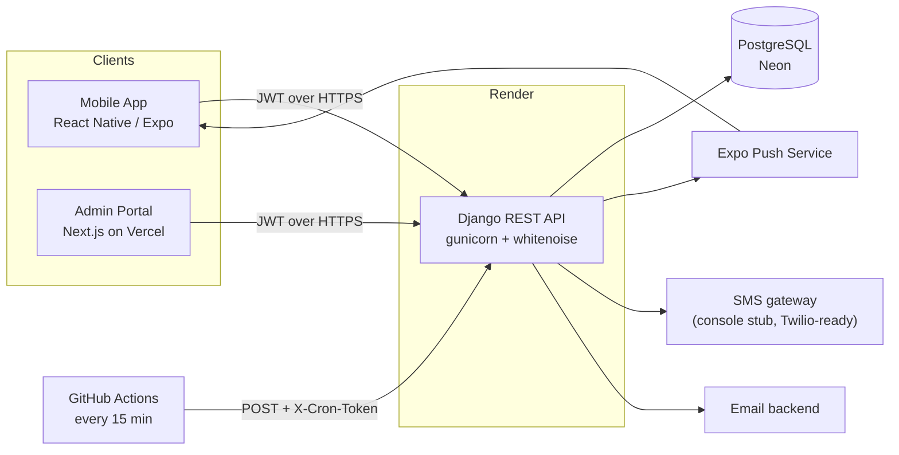
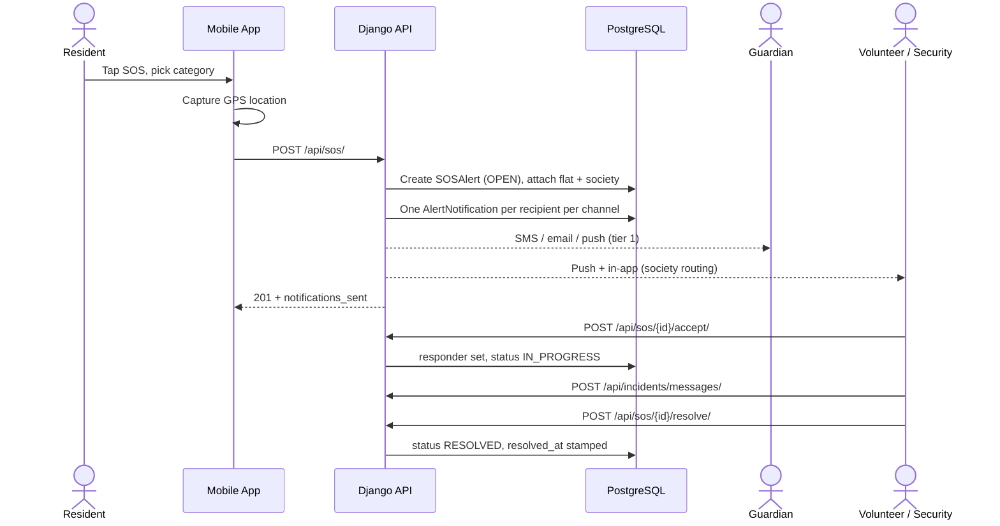
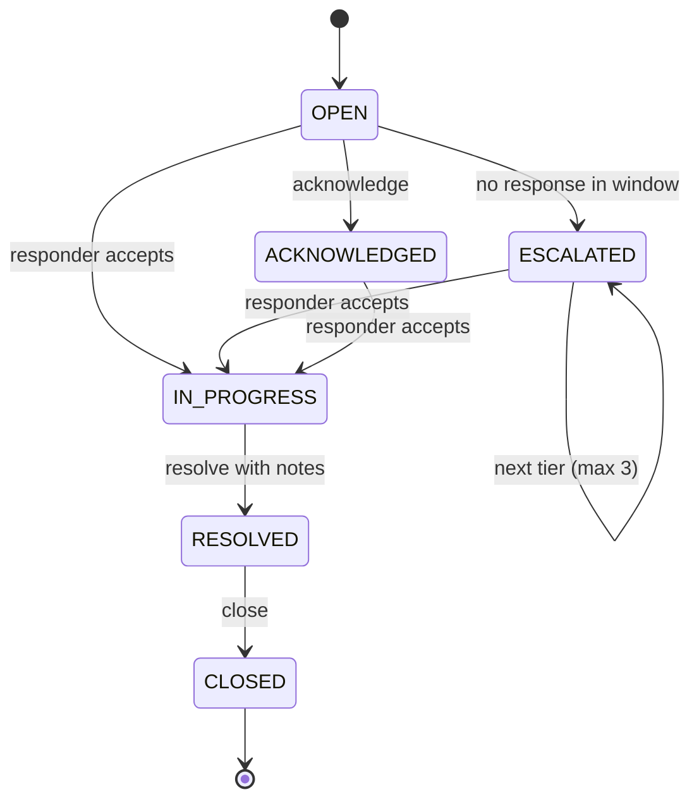

# System Architecture

## Overview

CERP has three clients-facing parts sharing one API:

- **Mobile app** (React Native / Expo) for residents, guardians, volunteers, and security staff
- **Admin portal** (Next.js) for society administrators
- **REST API** (Django + DRF) holding all business logic, backed by PostgreSQL

## Backend applications

| App | Responsibility | Key models |
|---|---|---|
| `accounts` | Users, roles, JWT auth, emergency contacts, admin user management | `User`, `EmergencyContact` |
| `societies` | Society / block / flat structure and resident mapping | `Society`, `Block`, `Flat`, `ResidentProfile` |
| `alerts` | SOS lifecycle, notification engine, escalation, analytics, scheduler endpoint | `SOSAlert`, `AlertNotification` |
| `incidents` | Incident chat thread and responder assignment | `IncidentMessage`, `ResponderAssignment` |

Notification logic is split in two layers:

- `alerts/services.py` decides **who** is notified and **why** (routing, escalation tiers)
- `alerts/notifications.py` decides **how** a message leaves the system (push, SMS, email, in-app)

Swapping the SMS provider therefore touches one function, not the routing rules.

## SOS flow

## Incident lifecycle

## Escalation

1. On SOS: tier 1 contacts (primary guardians) plus the whole society routing (security, available volunteers, community)
2. If nobody accepts within `ESCALATION_WINDOW_MINUTES`, the alert moves to tier 2 (secondary guardian)
3. After another window, tier 3 (emergency contacts)
4. Escalation stops at tier 3 and never repeats for a claimed alert

The check runs from `python manage.py run_escalations`. In production a GitHub Actions workflow calls the token-protected endpoint `POST /api/internal/run-escalations/` every 15 minutes, so no server shell or paid worker is needed.

## Security model

- Stateless JWT authentication; the access token carries the user's role
- Role-based visibility enforced in querysets, not only in the UI:
  - Admin / staff: all alerts
  - Security / volunteer: alerts in their own society
  - Resident: own alerts, plus those of anyone who lists them as a linked guardian
- Society and user management write access restricted to administrators
- First-responder lock: a second accept returns HTTP 409
- Scheduler endpoint requires a secret header, compared in constant time
- Secrets come from environment variables; nothing sensitive is committed
- Production: `DEBUG=False`, secure cookies, explicit CORS origins, HTTPS only

## Deployment

| Component | Host | Notes |
|---|---|---|
| API | Render (Singapore) | Auto-deploys from `main`; build runs migrate + seed |
| Database | Neon (Singapore) | Permanent free tier, SSL required |
| Admin portal | Vercel | Root directory `admin`, `NEXT_PUBLIC_API_URL` env var |
| Mobile | EAS Build | Installable Android APK (`preview` profile) |
| Scheduler | GitHub Actions | `.github/workflows/escalations.yml` |

Live URLs are listed in the root `README.md`.