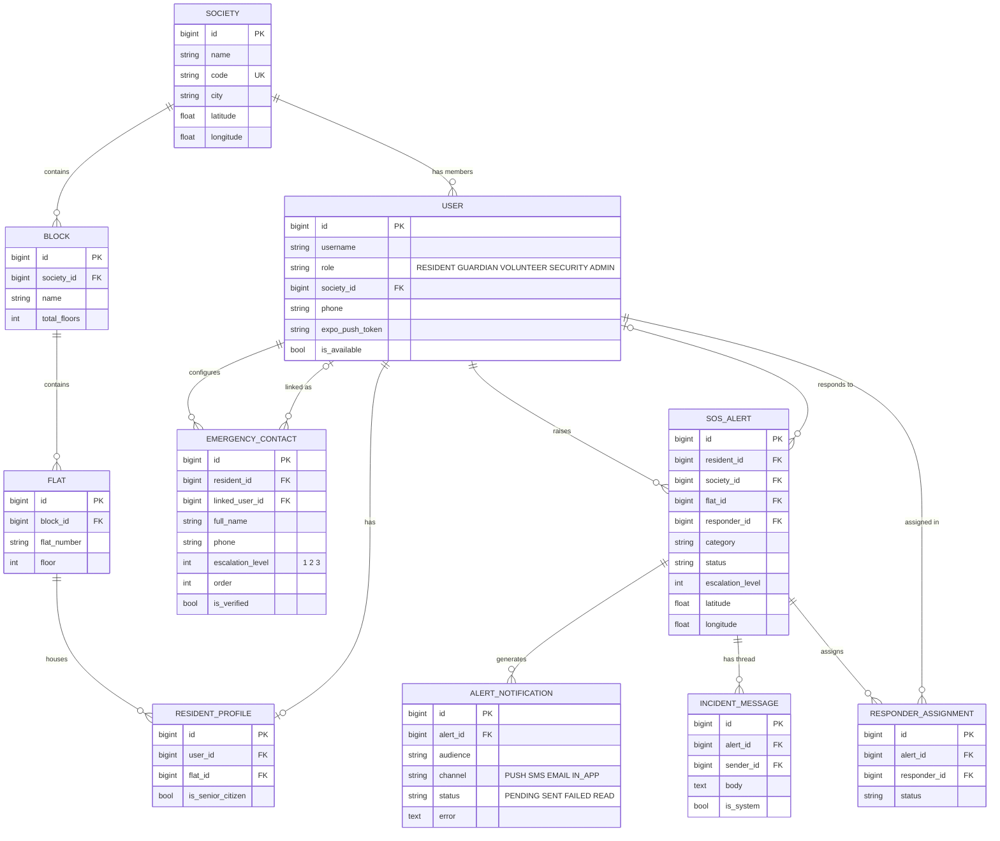

# Database Design

PostgreSQL 16. Ten models across four Django apps.

## Entity relationship diagram

## Tables

| Model | Purpose |
|---|---|
| `User` | Custom user (extends `AbstractUser`) with one of five roles, society link, push token, availability |
| `Society` | A residential community, identified by a unique join code |
| `Block` | Tower or wing within a society |
| `Flat` | Individual dwelling within a block |
| `ResidentProfile` | Binds a user to a flat so every alert carries an exact address |
| `EmergencyContact` | A contact at escalation tier 1, 2, or 3; optionally a registered user |
| `SOSAlert` | One emergency event with category, location, status, and tier |
| `AlertNotification` | One delivery attempt per recipient per channel, with status and error text |
| `IncidentMessage` | A message on an alert's thread; system messages flagged |
| `ResponderAssignment` | A responder's engagement state for an alert |

## Constraints

| Name | Columns | Purpose |
|---|---|---|
| `uniq_contact_slot` | resident, escalation_level, order | No two contacts in the same escalation slot |
| `uniq_block_per_society` | society, name | Block names unique within a society |
| `uniq_flat_per_block` | block, flat_number | Flat numbers unique within a block |
| `uniq_assignment` | alert, responder | A responder is assigned to an alert at most once |
| `Society.code` | code | Unique join code |

## Design notes

- **Custom user model from the first migration.** Django makes swapping it later very difficult.
- **Every notification is a row.** Failures (for example, a user with no push token) stay visible instead of silently disappearing.
- **Timestamps per lifecycle stage** (`acknowledged_at`, `escalated_at`, `resolved_at`, `closed_at`) power the average-resolution-time metric.
- **`SET_NULL` on optional links** (flat, society, responder) so deleting a flat or user never deletes alert history.